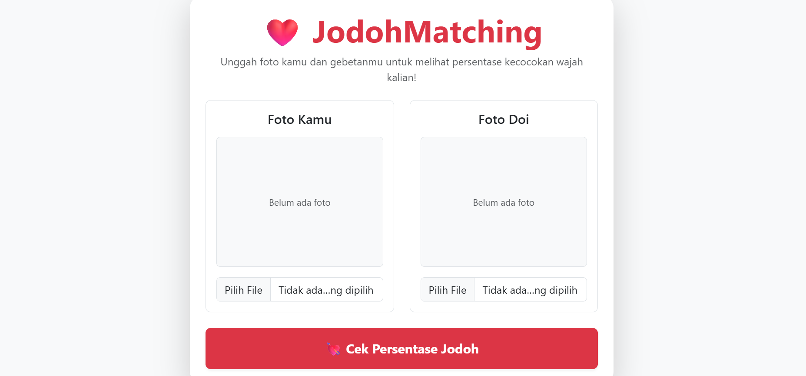
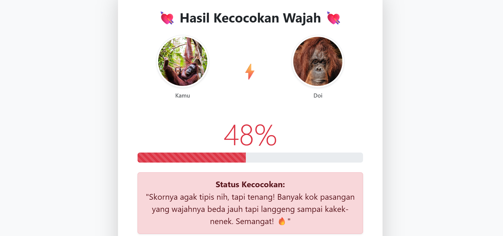

# JodohMatching

JodohMatching adalah sebuah aplikasi sederhana yang dibuat untuk seru-seruan (don't get pissed please) untuk mengukur seberapa cocok kamu dengan dia (DOI) dari kemiripan kontur wajah.

> Tampilan Layar Utama
> 

> Tampilan Layar Hasil
> 

# Cara Menjalankan Web ini

## Clone Repository ini

```bash
git clone https://github.com/rachmanz/JodohMatching.git
```

## Installasi Library

```bash
pip install -r requirements.txt
```

## Jalankan Aplikasi

```bash
python -m src.app
```

---

**Notes**: Semua proses dilakukan di lokal kalian. Jadi, jangan takut untuk mencoba yak! **Good Luck!**

**`DEVELOPED`**: 2026
